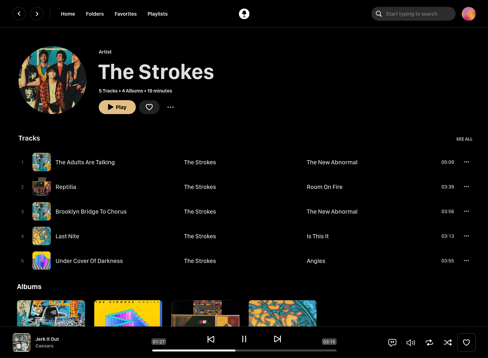

<div align="center" style="display: flex; justify-content: center; align-items: center;">
  
</div>
<div align="center" style="font-size: 2rem"><b>Swing Music</b></div>

<div align="center"><b><sub><code>v1.4.8</code></sub></b></div>
 
**<div align="center" style="padding-top: 1.25rem">[Download](https://swingmusic.vercel.app/downloads) • <a href="https://swingmusic.vercel.app/support-us.html" target="_blank">Support Development</a> • [Docs](https://swingmusic.vercel.app/guide/introduction.html) • [Screenshots](https://swingmusic.vercel.app) • [r/SwingMusicApp](https://www.reddit.com/r/SwingMusicApp)</div>**

##

[](https://raw.githubusercontent.com/swing-opensource/swingmusic/master/.github/images/artist.webp)

##

Swing Music is a beautiful, self-hosted music player for your local audio files. Like a cooler Spotify ... but bring your own music. Just run the app and enjoy your music library in a web browser.

### Installation

Swing Music is available as pre-compiled binaries for Windows and Linux. Just download the latest release from the [downloads page](https://swingmusic.vercel.app/downloads) and launch it.

[FFmpeg](https://ffmpeg.org/) is needed for the audio silence skip feature, so you need to install it first. On windows, you can follows [this tutorial](https://phoenixnap.com/kb/ffmpeg-windows) to install FFmpeg.

On Linux, you can install FFmpeg using:

```sh
sudo apt-get install ffmpeg libavcodec-extra -y
```

Then make the file executable first.

```bash
chmod a+x ./swingmusic

./swingmusic
```

The app should start at <http://localhost:1970> by default. Open it in your browser to use Swing Music. You can change the default port by using the `--port` flags.

```sh
swingmusic --port 1980
```

### Options

Options are flags that can be passed when starting the app in the terminal to tweak runtime settings or perform tasks. You can use the `-h` flag to see all supported options.

> [!TIP]
> You can read more about options in [the docs](https://swingmusic.vercel.app/guide/getting-started.html#options).

### Docker

Pull the latest Docker image and run it:

```sh
docker pull ghcr.io/swingmx/swingmusic:latest
```

```sh
docker run --name swingmusic -p 1970:1970 \
  -v /path/to/music:/music \
  -v /path/to/config:/config \
  --restart unless-stopped \
  ghcr.io/swingmx/swingmusic:latest
```

Don't forget to replace `/path/to/music` and `/path/to/config` with the appropriate values. In addition, specify the the `/music` directory as the root directory. Using the `Home Directory` option won't work.

> [!TIP]
> For more info, see the [Docker section](https://swingmusic.vercel.app/guide/getting-started.html#docker) on the docs.

#### Using Docker Compose

Here's a sample Docker compose file:

```yaml
services:
  swingmusic:
    image: swingmusic
    container_name: swingmusic
    volumes:
      - /path/to/music:/music
      - /path/to/config:/config
    ports:
      - "1970:1970"
    restart: unless-stopped
```

### Contributing

Swing Music is looking for contributors. If you're interested, please join us at the [Swing Music Community](https://t.me/+9n61PFcgKhozZDE0) group on Telegram. For more information, take a look at https://github.com/swing-opensource/swingmusic/issues/186.

[**CONTRIBUTING GUIDELINES**](.github/contributing.md).

### License

This software is provided to you with terms stated in the MIT License. Read the full text in the `LICENSE` file located at the root of this repository.

**[MIT License](https://opensource.org/licenses/MIT) | Copyright (c) 2023 Mungai Njoroge**

### Contributors

Shout out to the following code contributors who have helped maintain and improve Swing Music:

<div align="left">
  <table>
    <tr>
      <td align="center">
        <a href="https://github.com/cwilvx">
          
          <br />
          <sub><b>@cwilvx</b></sub>
        </a>
      </td>
      <td align="center">
        <a href="https://github.com/Ericgacoki">
          
          <br />
          <sub><b>@Ericgacoki</b></sub>
        </a>
      </td>
      <td align="center">
        <a href="https://github.com/Simonh2o">
          
          <br />
          <sub><b>@Simonh2o</b></sub>
        </a>
      </td>
      <td align="center">
        <a href="https://github.com/tcsenpai">
          
          <br />
          <sub><b>@tcsenpai</b></sub>
        </a>
      </td>
      <td align="center">
        <a href="https://github.com/jensgrunzer1">
          
          <br />
          <sub><b>@jensgrunzer1</b></sub>
        </a>
      </td>
      <td align="center">
        <a href="https://github.com/Type-Delta">
          
          <br />
          <sub><b>@Type-Delta</b></sub>
        </a>
      </td>
     <td align="center">
        <a href="https://github.com/MarcOrfilaCarreras">
          
          <br />
          <sub><b>@MarcOrfilaCarreras</b></sub>
        </a>
      </td>
    </tr>
    <tr>
    <td align="center">
      <a href="https://github.com/tralph3">
        
        <br />
          <sub><b>@tralph3</b></sub>
        </a>
      </td>
    </tr>
  </table>
</div>
